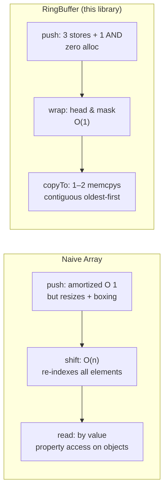
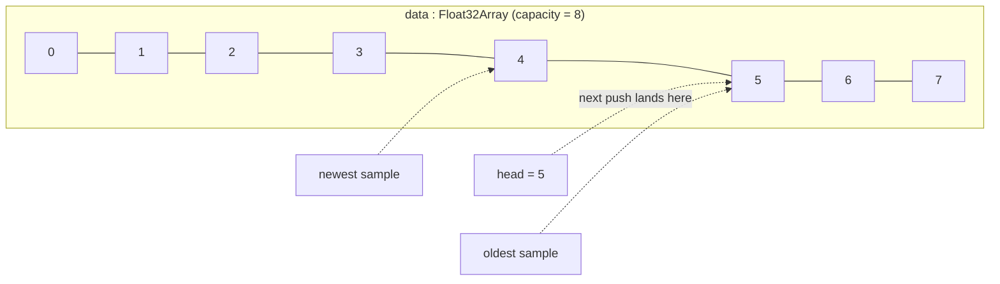
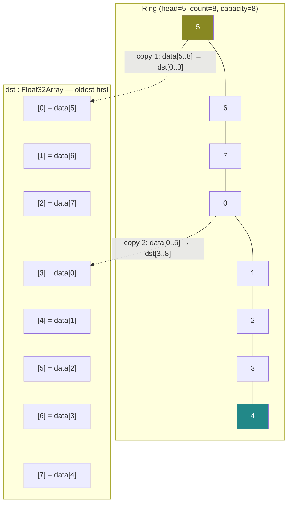
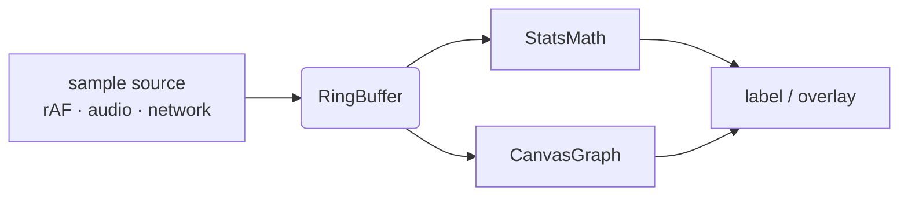

# @zakkster/lite-ring-buffer

[](https://www.npmjs.com/package/@zakkster/lite-ring-buffer)
[](https://bundlephobia.com/result?p=@zakkster/lite-ring-buffer)
[](https://www.npmjs.com/package/@zakkster/lite-ring-buffer)
[](https://www.npmjs.com/package/@zakkster/lite-ring-buffer)


[](https://opensource.org/licenses/MIT)

**Pre-allocated, zero-GC circular buffer over a `Float32Array`. Power-of-two capacity. Mask-based wrap. Oldest-first bulk copy.**

One allocation for the lifetime of the buffer. No `Array.shift`, no slicing, no per-frame `new Float32Array`. The `push` hot path is three indexed stores and a bitwise AND.

```js
import { RingBuffer } from '@zakkster/lite-ring-buffer';

const fps = new RingBuffer(1024);                  // → capacity = 1024 (already a pow2)

// Hot path — drop a sample every frame.
function onFrame(dt) {
  fps.push(1000 / dt);
}

// Read out the most recent sample.
fps.peekNewest();           // → 60.0

// Bulk-copy the entire window into your renderer / stats engine.
const window = new Float32Array(fps.count);
fps.copyTo(window, 0);      // window[0] is oldest, window[count-1] is newest
```

---

## Contents

- [Why](#why) · [Install](#install) · [Quick start](#quick-start)
- [How it works](#how-it-works)
- [API reference](#api-reference)
- [Edge cases & guarantees](#edge-cases--guarantees)
- [Companion libraries](#companion-libraries)
- [FAQ](#faq) · [License](#license)

---

## Why

You're sampling something — frame times, audio levels, mouse velocity, network RTT — and you want a sliding window of the last N values to render, average, or quantile.

The code you write first looks like this:

```js
// The first draft, and the version that bites you in production
const samples = [];
function pushSample(v) {
  samples.push(v);
  if (samples.length > 1024) samples.shift();   // O(n), per frame
}
```

Two problems compound at 60 fps:

1. `Array.shift()` is **O(n)** — every frame you re-index 1023 elements just to drop the front one.
2. The array is a *generic* JS array. Each entry is a boxed double; growth and resize trigger fresh allocations and shape transitions; the GC sees a moving target.

`@zakkster/lite-ring-buffer` collapses both costs:



The buffer is a `Float32Array` so reads and writes are unboxed `number → IEEE-754 float32` round trips — the same memory representation a GPU vertex buffer or a `<canvas>` waveform expects.

---

## Install

```bash
npm i @zakkster/lite-ring-buffer
```

ESM-only. No dependencies. Ships TypeScript definitions alongside the source.

```js
import { RingBuffer } from '@zakkster/lite-ring-buffer';
```

You can also drop `src/index.js` into your project directly — it's one file, ~120 lines.

---

## Quick start

### Telemetry window

```js
const frameTimes = new RingBuffer(512);

function tick(dt) {
  frameTimes.push(dt);
}

// Display the recent window in some UI.
function render() {
  const newest = frameTimes.peekNewest();
  const oldest = frameTimes.peekOldest();
  // ...
}
```

### Streaming into a stats engine

```js
import { RingBuffer } from '@zakkster/lite-ring-buffer';
import { StatsMath }   from '@zakkster/lite-stats-math';

const rb    = new RingBuffer(1024);
const stats = new StatsMath(rb.capacity);
const out   = { avg: 0, min: 0, max: 0, p01: 0, p99: 0 };  // hoisted, reused

function onSample(v) {
  rb.push(v);
}

function readout() {
  stats.compute(rb, out);
  return out;   // mutated in-place, no allocation per call
}
```

### Streaming into a `<canvas>` waveform

```js
import { RingBuffer } from '@zakkster/lite-ring-buffer';
import { CanvasGraph } from '@zakkster/lite-canvas-graph';

const rb = new RingBuffer(2048);
const graph = new CanvasGraph(canvas, 600, 200);

function frame(dtMs) {
  rb.push(dtMs);
  graph.render(rb, 33.34);   // expected max ≈ 30 fps budget
  requestAnimationFrame(frame);
}
```

---

## How it works

### Power-of-two capacity → bitmask wrap

The constructor rounds the requested capacity up to the next power of two:

| `requested` | `capacity` | `mask` |
|---:|---:|---:|
| 1 | 1 | 0 |
| 100 | 128 | 127 |
| 1024 | 1024 | 1023 |
| 1025 | 2048 | 2047 |

Wrap-around becomes `head = (head + 1) & mask` — a single AND instead of a `%` modulo, which on V8 is roughly 3–5× cheaper in tight loops.

### Layout



Once the buffer is full (`count === capacity`), `head` chases the oldest sample around the ring. There is no "front pointer" — the oldest is always at offset `(head - count + capacity) & mask`.

### Oldest-first bulk copy

`copyTo(dst, dstOffset)` writes oldest-first using at most two `TypedArray.set` calls:



`TypedArray.set` from a `subarray` is backed by a memcpy in V8 — there's no per-element loop in JS land.

---

## API reference

### `new RingBuffer(requestedCapacity = 1024)`

| Arg | Type | Description |
|---|---|---|
| `requestedCapacity` | `number` | Minimum capacity. Rounded up to the next power of two. |

Throws `RangeError` if `requestedCapacity` is not a finite positive number.

### Instance members

| Member | Type | Description |
|---|---|---|
| `requestedCapacity` | `number` (readonly) | What the caller asked for, before pow2 rounding. |
| `capacity` | `number` (readonly) | Actual storage size. Always a power of two. |
| `count` | `number` | Live samples, `0..capacity`. |
| `head` | `number` | Write cursor. Internal — exposed for inspection only. |
| `mask` | `number` | `capacity - 1`. Used in the wrap math. |
| `data` | `Float32Array` | Backing storage. Set to `null` after `destroy()`. |

### Methods

| Method | Returns | Description |
|---|---|---|
| `push(value)` | `void` | Append a sample. Overwrites the oldest when full. **Hot-path safe.** |
| `tryPush(value, options?)` | `boolean` | Like `push`, but returns `false` when full and `options.overwrite === false`. |
| `get(offset)` | `number \| undefined` | Sample at offset (0 = newest). `undefined` if out of range. |
| `getOrDefault(offset, default?)` | `number` | Same, with a default for out-of-range. |
| `peekNewest()` | `number` | Convenience for `getOrDefault(0, 0)`. |
| `peekOldest()` | `number` | Convenience for `getOrDefault(count - 1, 0)`. |
| `isFull()` | `boolean` | `count === capacity`. |
| `isEmpty()` | `boolean` | `count === 0`. |
| `copyTo(dst, dstOffset?)` | `number` | Write samples oldest-first into `dst`. Returns `count`. |
| `reset()` | `void` | Clear the buffer and zero the backing storage. |
| `destroy()` | `void` | Drop all references. Subsequent calls are undefined behavior. |

---

## Edge cases & guarantees

- **Capacity is always rounded up.** `new RingBuffer(100).capacity === 128`. The original is preserved on `requestedCapacity` so you can size sibling structures (e.g. a stats scratchpad) to either value as needed.
- **`get(0)` is the newest.** Negative or out-of-range offsets return `undefined` (`get`) or the default (`getOrDefault`). They never throw.
- **NaN and ±Infinity round-trip.** They store and read back unchanged. Downstream stats consumers must filter NaN themselves; `@zakkster/lite-stats-math` does this for you.
- **`tryPush` does not allocate when called without options.** The implementation reads the option object by property access (no destructuring default), so `tryPush(v)` is hot-path-safe just like `push(v)`.
- **`reset()` zeroes the backing memory.** This is intentional — without it, a fresh `copyTo` on a partially-filled buffer would surface stale samples. The cost is one `Float32Array.fill(0)`, which is a single memset in V8.
- **`destroy()` is final.** It nulls the typed array reference so the GC can reclaim the backing buffer in long-lived applications. After `destroy()`, the instance is unusable.
- **Hot-path zero-allocation.** `push`, `tryPush(v)`, `get`, `peekNewest`, `peekOldest`, `isFull`, `isEmpty` and `copyTo` allocate nothing on a steady-state call. The test suite includes a 1M-push smoke test that verifies sub-MB heap growth under `--expose-gc`.

---

## Companion libraries

- **[@zakkster/lite-stats-math](https://www.npmjs.com/package/@zakkster/lite-stats-math)** — single-pass avg/min/max/quantile over a `RingBuffer`, with a NaN-filtering compaction step.
- **[@zakkster/lite-canvas-graph](https://www.npmjs.com/package/@zakkster/lite-canvas-graph)** — zero-GC `<canvas>` waveform renderer that reads a `RingBuffer` directly. Decimates to per-pixel min/max envelopes when the sample count exceeds canvas width.

The three together form a complete telemetry pipeline:



Each stage holds zero allocation in steady state.

---

## FAQ

**Why power-of-two capacity? Why not just take the user's number?**
Because `head & mask` is a single instruction; `head % capacity` is a division. The cost difference is invisible on a single call but very real in tight emit loops where `push` is called once per frame *per metric* across dozens of metrics.

**Why `Float32Array` and not `Float64Array`?**
Two reasons: (1) telemetry numbers — frame times in ms, audio amplitudes, mouse velocity in px/s — fit comfortably in float32; (2) consumers like `<canvas>`, WebGL vertex buffers, and Web Audio nodes are all float32-native, so a downstream `copyTo` is a memcpy with no conversion.

**Can I push integers?**
Yes — they'll be implicitly converted to float32 on store, and read back losslessly for any value `|x| < 2^24`. Larger integers will lose precision; for u32 telemetry use a u32-backed sibling library or pack into the 24-bit mantissa.

**Why is `tryPush` slower than `push` in microbenchmarks?**
It branches on the `options` argument and the full state. For most callers `push` is the right choice; reach for `tryPush` only when discarding samples on overflow is a *correctness* requirement (e.g. lossy network ingest).

**Can I share a `RingBuffer` across a `Worker`?**
Not directly — the `Float32Array` lives in the main thread's heap. For cross-thread streaming, build the typed array on a `SharedArrayBuffer` yourself and adopt the same head/mask discipline; the algorithm is the same.

---

## License

MIT © Zahary Shinikchiev
